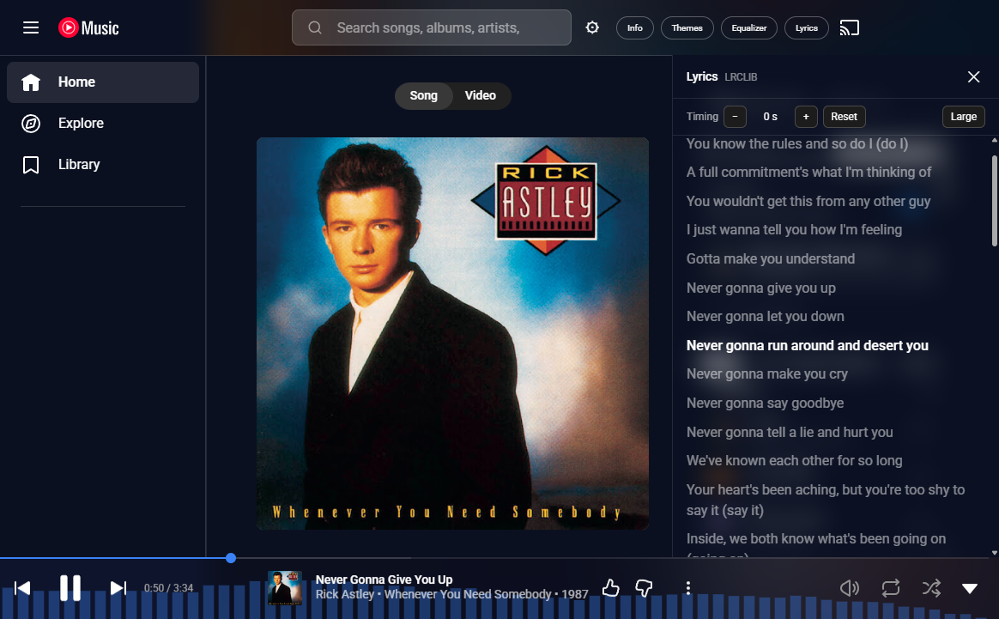
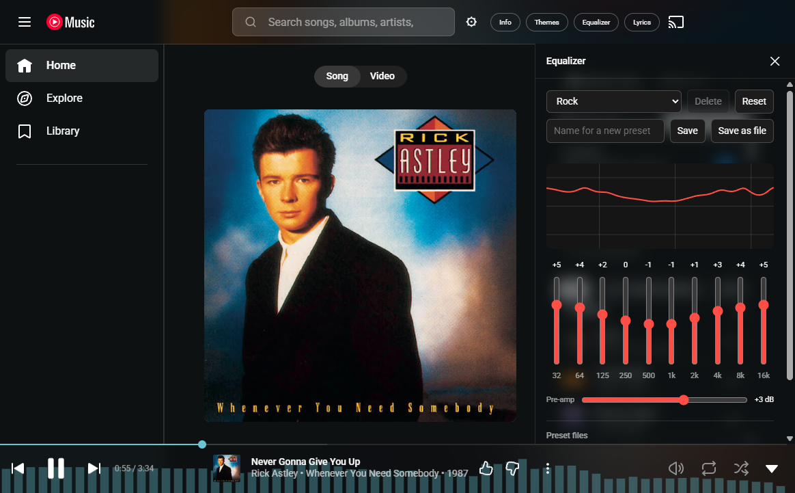
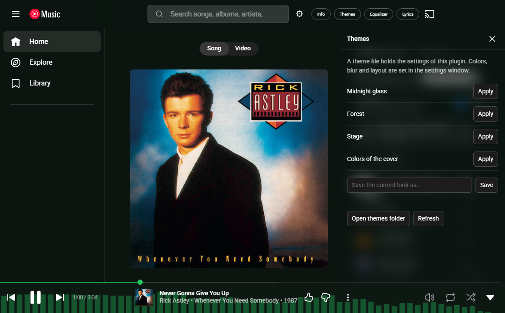
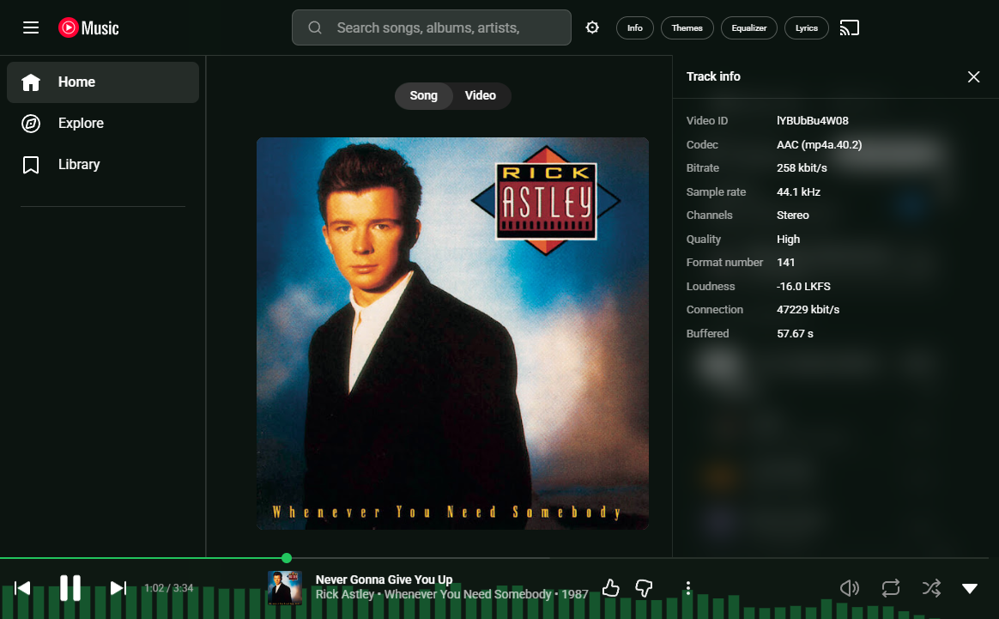
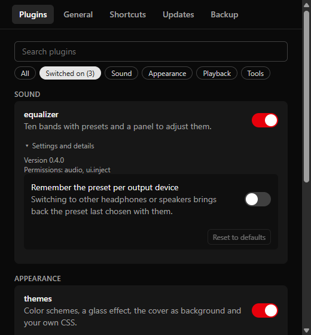

<h1 align="center">YouTube Music Desktop</h1>

<p align="center">
  YouTube Music as a desktop app: the original site, plus an equalizer, lyrics,<br>
  themes, a tray icon, global shortcuts and plugins you can write yourself.
</p>

<p align="center">
  <a href="https://github.com/Ariazonaa/ytmusic-desktop/actions/workflows/ci.yml"></a>
  <a href="LICENSE"></a>
  
</p>

<p align="center">
  
</p>

## What it is

A small window around `music.youtube.com`. You get YouTube Music exactly as
Google makes it, with your account, your library and your playlists, and the
app adds what a website cannot do:

- **Better sound:** a ten-band equalizer with headphone corrections, loudness
  normalization, crossfade, crossfeed for headphones, a compressor and a
  limiter.
- **More to see:** time-synced lyrics, color themes, the cover as background,
  a spectrum behind the player bar.
- **Less in the way:** SponsorBlock skips the talking in music videos, and
  tracks you disliked are skipped by themselves.
- **A real desktop app:** tray icon, global shortcuts, media keys, start with
  Windows, and it picks up the track where you stopped.
- **Light:** the installer is under 3 MB. The app is built with
  [Tauri](https://tauri.app) and uses the browser engine Windows already has,
  instead of bringing its own.
- **Private:** no statistics, no account, no server of its own; the one thing
  it asks for is whether there is a newer version, and that can be switched off.
  [What leaves your computer](#privacy) is written down.

Everything is a plugin and off until you switch it on. The app is in English
and German.

## Pictures

| | |
| --- | --- |
|  |  |
| **Equalizer** with presets, your own curves and [headphone corrections](#headphone-corrections). Here the colors follow the cover. | **Themes:** color schemes, accent colors, frosted glass. A look can be saved and [shared](#sharing-themes-and-presets). |
|  |  |
| **Track info:** codec, bitrate, loudness and connection speed of what is playing. | **Settings window:** every plugin with a switch, its permissions and its settings. |

## Install

Windows 10 or 11.

**[Download the installer](https://github.com/Ariazonaa/ytmusic-desktop/releases/latest)**
(`ytmusic-desktop_…_x64-setup.exe`) and run it. It installs for your user only
and needs no administrator rights.

The installer is not signed with a certificate, so Windows SmartScreen may
warn about an unknown publisher; "More info" and "Run anyway" get past that.

**Updates:** the app looks for a newer version when it starts and tells you.
You install it with one click in the settings window, under Updates; nothing
is installed by itself. The check can be switched off there.

To build it yourself instead, see
[docs/development.md](docs/development.md#setup).

Linux and macOS are not supported yet; [docs/platforms.md](docs/platforms.md)
says how far that is.

## First steps

1. Start the app and sign in to Google, as you would in a browser.
2. The settings window opens by itself the first time. Later, the gear button
   next to the search field opens it, and so does the tray menu.
3. Switch on the plugins you want. They start at once, without a restart.
4. Plugins with an interface of their own put a button next to the gear:
   Lyrics, Equalizer, Themes, Info.

## Plugins

### Sound

| Plugin | What it does |
| --- | --- |
| `equalizer` | Ten bands from 32 Hz to 16 kHz with presets (bass boost, vocal, rock and others) and a pre-amplifier. The panel has a slider per band and a graph of the result; you hear changes while dragging. Your own curves can be saved as presets and [shared](#sharing-themes-and-presets). Imports [headphone corrections](#headphone-corrections) and can remember a preset per output device. |
| `normalize` | Brings every track to the same loudness, using the loudness YouTube Music measured for it. YouTube Music itself only turns down the very loud ones; this also raises the quiet ones. Three targets, and a limit on how far a quiet track is boosted. |
| `crossfade` | The end of a track plays over the start of the next, for 1 to 10 seconds. Not together with `track-fade` or `playback-speed`. [How it works and what it costs](docs/development.md#how-the-crossfade-works). |
| `track-fade` | The simple alternative: each track fades out at its end and the next one fades in. |
| `headphones` | Crossfeed: mixes a little of each channel into the other, slightly delayed and without its treble, as happens with speakers. Takes the hard left and right out of old recordings. Also sets the stereo width, from mono to twice as wide. |
| `compressor` | Evens out loud and quiet passages, in three strengths. |
| `limiter` | Holds peaks just below full scale, so that what the equalizer, `normalize` or `audio-tools` boost does not clip. |
| `audio-tools` | Volume boost up to 300 %, left/right balance and mono. |

### Appearance

| Plugin | What it does |
| --- | --- |
| `themes` | Color schemes (black, slate, midnight blue, forest, plum), an accent color, frosted-glass bars, the cover of the playing song as a blurred background, a narrower or window-filling content column, and a field for your own CSS. Colors can follow the cover. Four ready-made themes are included. |
| `visualizer` | The spectrum of what is playing, as bars behind the player bar, in the accent color. |

### Playback

| Plugin | What it does |
| --- | --- |
| `sponsorblock` | Skips sponsors, non-music sections and similar parts of music videos, using the [SponsorBlock](https://sponsor.ajay.app) database. Categories can be chosen one by one. A notice says what was skipped, and its button plays the part after all. |
| `skip-disliked` | Goes on to the next track when one comes up that you gave a thumbs down. |
| `audio-only` | When a music video comes up, switches to its audio version, as the Song button above the player does. Saves bandwidth and processor time. |
| `playback-speed` | Plays everything at 0.5 to 2 times the speed, with or without keeping the pitch. |
| `prefer-opus` | Makes the player choose Opus audio instead of AAC. |
| `wheel-volume` | Turning the mouse wheel over the player bar changes the volume. |

### Tools

| Plugin | What it does |
| --- | --- |
| `lyrics` | A side panel with time-synced lyrics from [LRCLIB](https://lrclib.net); clicking a line jumps to it. Plain lyrics from [lyrics.ovh](https://lyrics.ovh) if LRCLIB has none. A large view fills the window, and plus and minus shift lyrics that run ahead of or behind the sound, remembered per track. |
| `track-info` | A panel with codec, bitrate, sample rate, loudness and connection speed of the playing track. |
| `demo` | A working template for people who write plugins. |

### Plugins from others

Anyone can write a plugin: a folder with a `plugin.json` and an `index.js`.

- **Install:** "Install from a zip file" in the settings window. Or put the
  plugin's folder into the plugins folder ("Open plugins folder") and click
  "Reload plugins".
- **Remove:** "Remove" next to the plugin deletes its folder, after asking
  once more.
- **What it may do:** a plugin from elsewhere runs locked away from the page.
  It cannot see your cookies or your Google account, and it reaches the
  network only at the addresses it names. The settings window shows what a
  plugin asks for before you switch it on. `ui.inject` lets a plugin restyle
  the whole page, and `network` lets it send what it can read to the hosts it
  lists, so only switch on plugins whose permissions make sense for what they
  do.

Want to write one? [docs/plugins.md](docs/plugins.md) is the guide, and
[`examples/plugins/hello`](examples/plugins/hello) a working example.

## The desktop side

- **Tray icon:** shows the playing song. Its menu has Play / Pause, Next,
  Previous, the volume and Quit. Closing the window can keep the music playing
  in the tray, where the app also gives back most of its memory.
- **Global shortcuts:** key combinations for play / pause, next, previous,
  volume and mute that work while another program has the focus. None are set
  at first; click a field in the settings window and press the combination.
- **Media keys** work as in a browser.
- **Start with Windows**, if you like without opening a window.
- **Resume:** the track from last time is loaded again, paused where it
  stopped.
- **No connection:** instead of the browser's error page the app shows its
  own, and goes back to the music by itself once the connection is there.
- **When YouTube Music changes** and something stops working, the settings
  window says what, instead of features silently doing nothing.
- **Updates:** found at start, installed when you say so.
- **Backup:** all settings can be exported to a file and imported again.
- **Language:** English or German for everything the app adds. It follows
  Windows unless you choose one. YouTube Music itself keeps the language of
  your Google account.

Errors are written to a log file that the settings window opens.

## Sharing themes and presets

Themes and equalizer presets can be saved as files and passed on. Each is one
small JSON file in a folder of its kind under
`%APPDATA%\io.github.ariazonaa.ytmusic-desktop`: `themes` or `equalizer`. To
share one, pass the file on; to use someone else's, put it into the folder and
press Refresh in the plugin's panel. Both panels have a button that opens
their folder.

A theme file holds settings of the `themes` plugin:

```json
{
  "name": "Midnight glass",
  "settings": { "scheme": "midnight", "accent": "green", "blur": 14, "coverBackground": true }
}
```

A theme cannot run code, but its `customCss` can restyle or hide anything on
the page, so the panel marks themes that bring their own CSS. Unknown keys are
ignored and invalid values fall back to the default.

An equalizer preset holds the gain of each band and of the pre-amplifier:

```json
{
  "name": "Bass",
  "settings": { "band32": 9, "band64": 5, "band125": 0, "band16000": -4, "preamp": -2 }
}
```

Bands a file leaves out count as 0 dB, and values are kept within the sliders'
range of ±12 dB.

### Headphone corrections

[AutoEq](https://github.com/jaakkopasanen/AutoEq) publishes equalizer settings
that correct the sound of several thousand headphone models. "Import AutoEq
file" in the equalizer's panel reads the text files it offers for a model:

- `… FixedBandEQ.txt` fits best: it has the equalizer's ten bands.
- `… ParametricEQ.txt` and `… GraphicEQ.txt` are converted to the ten bands,
  which is an approximation.

The import saves the curve as a preset named after the file, switches to it
and sets the pre-amplifier the file asks for. Gains are rounded to whole dB
and kept within ±12 dB.

With "Remember the preset per output device" on in the plugin's settings, the
equalizer notes which preset you choose while sound goes to a device, and
brings it back when sound goes there again: one preset for the headphones,
another for the speakers.

## Privacy

What leaves your computer because of this app, as opposed to because of
YouTube Music itself.

**The app.** It sends no statistics and no crash reports, and it has no
server. The one request of its own is the look for updates: at each start it
fetches a small file from this project's releases on `github.com`, which
names the newest version. The request carries nothing about you or the app;
GitHub sees your IP address, as every server does. "Look for updates at
start" in the settings window switches it off. An update itself is downloaded
from there too, only when you click to install it, and only installed if it
carries this project's signature. The window is a browser showing
`music.youtube.com`, so Google sees what it would see in any browser, with
your Google account if you sign in. The browser engine is Microsoft's WebView2,
which is part of Windows.

**Built-in plugins.** Only two contact anyone besides Google, and only while
they are switched on:

| Plugin | Contacts | Sends | When |
| --- | --- | --- | --- |
| `sponsorblock` | `sponsor.ajay.app` | the first four characters of a hash of the video id, not the id itself | once for every track |
| `lyrics` | `lrclib.net` | title and artist of the playing song | once for every track |
| `lyrics` | `api.lyrics.ovh` | title and first artist | only if LRCLIB has no lyrics |

These requests carry no cookies and no referrer. The servers see your IP
address, as every server does. `themes` loads the cover of the playing song a
second time from Google's image servers when it is set to take its colors from
the cover. All other built-in plugins work on your computer only.

The page can ask the app for the name of the device sound goes to, such as
"Headphones (WH-1000XM4)"; the equalizer uses it to remember a preset per
device. Like everything the app offers to its plugins, this is within reach of
YouTube Music's own scripts too. Nothing in the app sends it anywhere.

**Plugins from others.** Such a plugin can only reach the hosts its manifest
lists, which the settings window shows, and only to fetch JSON and images. To
those it can send whatever its permissions let it read, with `music.read`
what you listen to. It cannot read cookies, your Google account or anything
else on the page.

**What is kept on your computer**, under
`%APPDATA%\io.github.ariazonaa.ytmusic-desktop` unless noted:

- `settings.json`: the settings, including those of the plugins, such as
  saved equalizer presets, the names of your output devices if the equalizer
  remembers a preset for each, lyrics timing corrections by video id and the
  time SponsorBlock skipped.
- `log.txt`: errors. A line can name a plugin or a web address that failed.
- `themes` and `equalizer`: the files you saved to share.
- `plugins`: the plugins from others you installed.
- The browser profile, in `%LOCALAPPDATA%\io.github.ariazonaa.ytmusic-desktop`:
  what a browser keeps for a site, including your sign-in to Google, and the
  track and position to resume from.

Uninstalling the app leaves these folders; delete them to remove everything.

## More to read

| | |
| --- | --- |
| [CHANGELOG.md](CHANGELOG.md) | what changed in each version |
| [docs/plugins.md](docs/plugins.md) | writing plugins: a first one step by step, the API, the manifest |
| [docs/development.md](docs/development.md) | building and testing the app, how it is put together, the settings file, memory and speed measurements |
| [docs/platforms.md](docs/platforms.md) | Linux and macOS: what works and what is open |

Found a bug or have an idea? Open an
[issue](https://github.com/Ariazonaa/ytmusic-desktop/issues). The settings
window's log usually says what went wrong.

## License and trademarks

The code of this project is under the [MIT license](LICENSE): use it, change it
and pass it on, as long as the license text stays with it. Plugins from
others have their own licenses.

This is an independent project. It is not made, endorsed or supported by
Google. YouTube and YouTube Music are trademarks of Google LLC; the app shows
Google's own website and contains none of its code or content. Using it is
subject to YouTube's terms of service, as using the site in a browser is.
SponsorBlock, LRCLIB and lyrics.ovh are services of their own, used through
their public interfaces; their data is under their terms.
